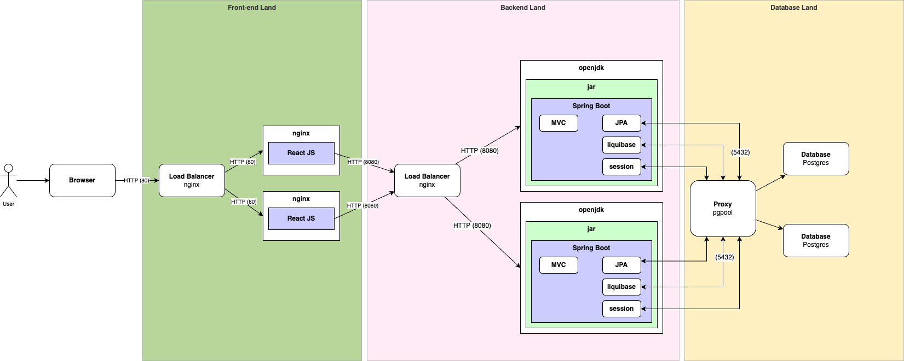
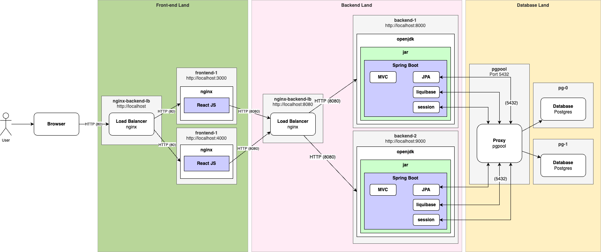
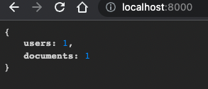
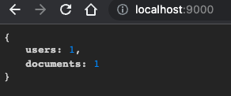
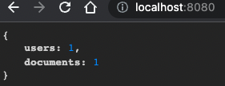
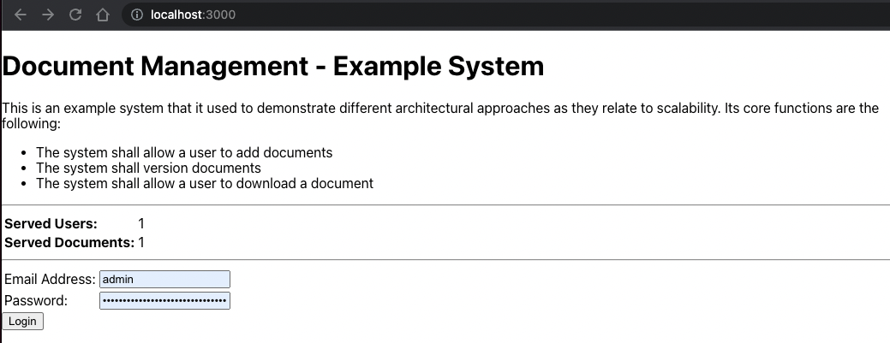
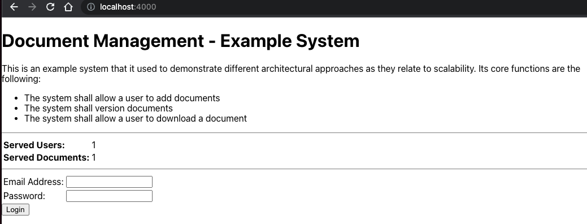
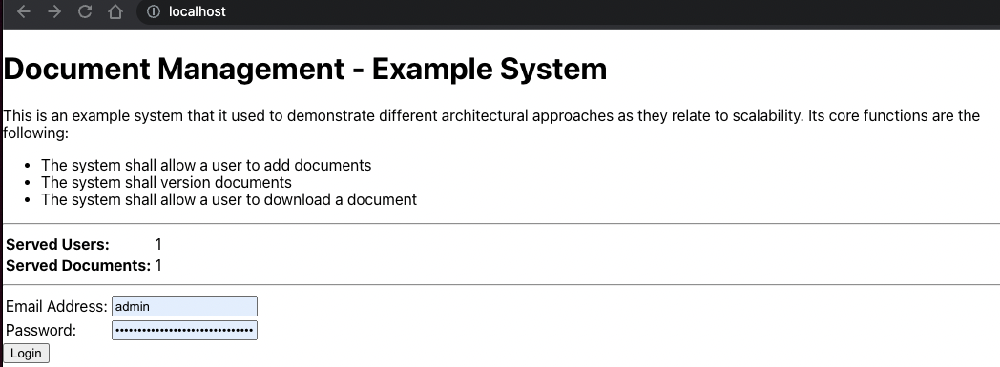

# System Echo (REST)

Prerequisites

- https://github.com/jvalentino/sys-alpha-bravo
- https://github.com/jvalentino/sys-charlie
- https://github.com/jvalentino/sys-delta

This is an example system that it used to demonstrate different architectural approaches as they relate to scalability. Its core functions are the following:

- The system shall allow a user to add documents
- The system shall version documents
- The system shall allow a user to download a document

This specific implementation uses a 3-tier architecture, where the front-end has been broken into its own independent application is separately load balanced.

It specifically now consists of two repositories

- https://github.com/jvalentino/sys-echo-rest
- https://github.com/jvalentino/sys-echo-ui

## Previous System

**Database Cluster (Rating: hundreds)**

Now it is time to handle the database being a bottleneck. We handle it the same way we always do, by adding more instances. At the same time though to really see support higher load, we can't have user session information in memory so we move it into the database instead, removing the need for sticky sessions.

[](https://github.com/jvalentino/clothes-closet-wiki/blob/main/wiki/step-4.png)

Pros

- Backend and Database independent, allowing us have different optimized servers.
- Multple backends allows us to handle more load from users.
- A database cluster removes the database from being the solo bottlekneck.
- Session is maintained in the database, taking it out of memory.

Cons

- No separation between front-end and backend.
- Incentivizes a snowflake architecture by having to fine tune the server hardware differently.
- You are paying for that second instance even when you don't need it.
- The more data that goes into the database, the slower it performs.
- The addition of database land tripled the budget in hardware costs.
- Core reliance on RDMS limits upper scalability.

## Current System

**3-Tier with Database Cluster (Rating: a thousand)**

Before jumping off into higher load ratings, it is important to understand the realization that front-end was best to be separated from backend, giving us what we commonly call 3-tier. Instead of relying on the single backend to do everything, we started buidling standalone Javascript based front-end to dynamically render content asynchronously, and only calling the backend when needed. Contunuing on the current path, that makes our last example now look like this:

[](https://github.com/jvalentino/clothes-closet-wiki/blob/main/wiki/step-5.png)

Pros

- Backend and Database independent, allowing us have different optimized servers.
- Multple backends allows us to handle more load from users.
- A database cluster removes the database from being the solo bottlekneck.
- Session is maintained in the database, taking it out of memory.
- Separation between backend and frontend allows for slightly more load.

Cons

- Incentivizes a snowflake architecture by having to fine tune the server hardware differently.
- You are paying for that second instance even when you don't need it.
- The more data that goes into the database, the slower it performs.
- The addition of database land tripled the budget in hardware costs.
- Core reliance on RDMS limits upper scalability.

# Architecture

## Changes

Project renaming and import:

- settings.gradle - project name
- Docker-compose.yaml - rename containers to echo
- docker-compose-system.yaml - rename containers to echo (Tomcat containers will go away)
- Rename DeltaApp to EchoApp
- Rename delta package to echo under src and test
- SpringWebConfig - rename path to echo
- DocVersionRepo - Rename class HQL to echo
- Run `./gradlew check` to ensure all unit/integration tests pass

Now it is time to verify everything still works:

- `docker compose up -d`
- Connect to database in pgadmin, create new database called `examplesys`
- Create new Gradle Application runtime in IntelliJ that runs `tomcatRunWar`
- Run the system using `./gradlew tomcatRunWar`, and catch the admin password in the logs
- Go http://localhost:8080 and login, upload a document, and then view versions
- Commit it all, and verify that the pipeline still works

Now we are doing to take out all this JSP stuff:

- Delete the entire `controller` package
- Delete `MyServletInitializer`
- Delete `addResourceHandlers` and `viewResolver` from `SpringWebConfig`
- Delete a ton of stuff from build.gradle: war plugin, idea plugin, `spring-boot-starter-tomcat`, all the dependencies labeled `JSP Magic`
- From build.gradle, remove the gretty stuff
- Take `SpringBootServletInitializer` and `configure` out of EchoApp
- Refresh gradle dependencies in IntelliJ, and then run `./gradlew check`

At this point, we are going to replace one controller at a time with a REST endpoint instead. But first we can now run the application directly out of the IDE as a pure Spring Boot application.

### /

This is the easiest place to start because it doesn't involve security. We just rename HomeModel to HomeDto, and have that be the result object.

```groovy
@Controller
@Slf4j
@RestController
@CompileDynamic
class HomeRest {

    @Autowired
    UserService userService

    @Autowired
    DocService docService

    @GetMapping('/')
    HomeDto index() {
        log.info('Rendering index')
        HomeDto response = new HomeDto()
        response.with {
            users = userService.countCurrentUsers()
            documents = docService.countDocuments()
        }

        response
    }

}
```

The end result of http://localhost:8080 is then:

```json
{
   "users":1,
   "documents":1
}
```

### /custom-login

We are just returning a general Result (true or false), which when false contains a general error message like "invalid credentials":

```groovy
@Controller
@Slf4j
@RestController
@CompileDynamic
class LoginRest {

    @Autowired
    AuthenticationManager authenticationManager

    @Autowired
    UserService userService

    @PostMapping('/custom-login')
    ResultDto login(@RequestBody UserDto user) {
        userService.login(user, authenticationManager)
    }

}
```

It is recommended you use Postman to test it, but you can also just use curl:

```bash
curl -v --location --request POST 'http://localhost:8080/custom-login' \
--header 'Content-Type: application/json' \
--data-raw '{
    "email":"admin",
    "password": "6c8ec11f-9f8e-4b9d-b861-c2eebec81b34"
}'
```

In the result, we will later need the session information that is given in the header:

```bash
   Trying 127.0.0.1:8080...
* Connected to localhost (127.0.0.1) port 8080 (#0)
> POST /custom-login HTTP/1.1
> Host: localhost:8080
> User-Agent: curl/7.79.1
> Accept: */*
> Content-Type: application/json
> Content-Length: 79
> 
* Mark bundle as not supporting multiuse
< HTTP/1.1 200 
< Vary: Origin
< Vary: Access-Control-Request-Method
< Vary: Access-Control-Request-Headers
< X-Content-Type-Options: nosniff
< X-XSS-Protection: 1; mode=block
< Cache-Control: no-cache, no-store, max-age=0, must-revalidate
< Pragma: no-cache
< Expires: 0
< X-Frame-Options: DENY
< Set-Cookie: SESSION=ZGUxMGFlOTYtZDEyNS00ZmU5LTlkZTQtYjg1NDgyMDBhM2Vj; Path=/; HttpOnly; SameSite=Lax
< Content-Type: application/json
< Transfer-Encoding: chunked
< Date: Mon, 20 Feb 2023 17:57:11 GMT
< 
* Connection #0 to host localhost left intact
{"success":true,"message":null}
```

In this case:  SESSION=ZGUxMGFlOTYtZDEyNS00ZmU5LTlkZTQtYjg1NDgyMDBhM2Vj


### /dashboard

We are creating `DashboardRest` and instead of `DashboardModel` we are using `DashboardDto`:

```groovy
@CompileDynamic
@RestController
@Slf4j
class DashboardRest {

    @Autowired
    DocService docService

    @GetMapping('/dashboard')
    DashboardDto dashboard() {
        log.info('Rendering dashboard')

        DashboardDto dashboard = new DashboardDto()
        dashboard.with {
            documents = docService.allDocs()
        }

        dashboard
    }

}
```

To hit this though, you now need to be logged in which you means you have to provide the session token:

```bash
curl -v --location --request GET 'http://localhost:8080/dashboard' \
--header 'Content-Type: application/json' \
--header 'Cookie: SESSION=ZGUxMGFlOTYtZDEyNS00ZmU5LTlkZTQtYjg1NDgyMDBhM2Vj'
```

When running the main class you can now directly hit http://localhost:8080/dashboard and see a problem:

```json
{
   "documents":[
      {
         "docId":2,
         "name":"sample.pdf",
         "mimeType":"application/pdf",
         "createdByUser":{
            "authUserId":1,
            "email":"admin",
            "password":"$1$skh6IULO$AydCPNg.8MdflxOBShEmI0",
            "salt":"$1$skh6IULO",
            "firstName":"admin",
            "lastName":"admin"
         },
         "updatedByUser":{
            "authUserId":1,
            "email":"admin",
            "password":"$1$skh6IULO$AydCPNg.8MdflxOBShEmI0",
            "salt":"$1$skh6IULO",
            "firstName":"admin",
            "lastName":"admin"
         },
         "createdDateTime":1676902931940,
         "updatedDateTime":1676902931940,
         "versions":null,
         "tasks":null
      }
   ]
}
```

The hashed passwords are in the payload!

This is something you didn't have to worry about before, but now you do. You can just exclude that information form the JSON results:

```groovy
class AuthUser {

    @Id @GeneratedValue
    @Column(name = 'auth_user_id')
    Long authUserId

    String email

    @JsonIgnore
    String password

    @JsonIgnore
    String salt

```

 With the result now being:

```json
{
   "documents":[
      {
         "docId":2,
         "name":"sample.pdf",
         "mimeType":"application/pdf",
         "createdByUser":{
            "authUserId":1,
            "email":"admin",
            "firstName":"admin",
            "lastName":"admin"
         },
         "updatedByUser":{
            "authUserId":1,
            "email":"admin",
            "firstName":"admin",
            "lastName":"admin"
         },
         "createdDateTime":1676902931940,
         "updatedDateTime":1676902931940,
         "versions":null,
         "tasks":null
      }
   ]
}
```

### /view/versions

Same pattern, name the model class to a DTO, and then return it as the method result:

```groovy
@GetMapping('/view-versions/{docId}')
    ViewVersionDto index(@PathVariable(value='docId') Long docId) {
        ViewVersionDto result = new ViewVersionDto()
        result.with {
            doc = docService.retrieveDocVersions(docId)
        }

        log.info("Doc ${docId} has ${result.doc.versions.size()} versions")

        result
    }
```

cURL can be used to invoke the service:

```bash
curl -v --location --request GET 'http://localhost:8080/view-versions/2' \
--header 'Content-Type: application/json' \
--header 'Cookie: SESSION=ZGUxMGFlOTYtZDEyNS00ZmU5LTlkZTQtYjg1NDgyMDBhM2Vj'
```

Resulting in:

```json
{
    "doc": {
        "docId": 2,
        "name": "sample.pdf",
        "mimeType": "application/pdf",
        "createdByUser": null,
        "updatedByUser": null,
        "createdDateTime": 1676902931940,
        "updatedDateTime": 1676902931940,
        "versions": [
            {
                "docVersionId": 3,
                "versionNum": 1,
                "doc": null,
                "data": null,
                "createdDateTime": 1676902931940,
                "createdByUser": null
            }
        ],
        "tasks": null
    }
}
```

### /download/version

This returns binary data, and doesn't have to be changed at all:

```groovy
// https://www.baeldung.com/servlet-download-file
    @GetMapping('/version/download/{docVersionId}')
    void downloadVersion(@PathVariable(value='docVersionId') Long docVersionId, HttpServletResponse response) {
        DocVersion version = docService.retrieveVersion(docVersionId)

        response.setContentType(version.doc.mimeType)
        response.setHeader('Content-disposition',
                "attachment; filename=${version.doc.name.replaceAll(' ', '')}")

        InputStream is = new ByteArrayInputStream(version.data)
        OutputStream out = response.getOutputStream()

        byte[] buffer = new byte[1048]

        int numBytesRead
        while ((numBytesRead = is.read(buffer)) > 0) {
            out.write(buffer, 0, numBytesRead)
        }
    }
```

If you invoke http://localhost:8080/version/download/3 via postman, you can see the PDF in the body instead of having to worry about it with cURL.

### /version/new *

Same pattern as before, no more redirect and just return the ResultDto:

```groovy
 @PostMapping('/version/new/{docId}')
    ResultDto upload(@RequestParam('file') MultipartFile file, @PathVariable(value='docId') Long docId) {
        AuthUser user = userService.currentLoggedInUser()

        docService.uploadNewVersion(user, file, DateGenerator.date(), docId)

        new ResultDto()
    }
```

However, this can be quite involved with trying to get it work through cURL or Postman, so we are going to wait to verify it when the UI is hooked up.

### /upload-file *

Same pattern as before, no more redirect and just return the ResultDto:

```groovy
@Controller
@Slf4j
@RestController
@CompileDynamic
class UploadRest {

    @Autowired
    DocService docService

    @Autowired
    UserService userService

    @PostMapping('/upload-file')
    ResultDto upload(@RequestParam('file') MultipartFile file) {
        AuthUser user = userService.currentLoggedInUser()
        docService.uploadNewDoc(user, file, DateGenerator.date())

        new ResultDto()
    }

}
```

However, this can be quite involved with trying to get it work through cURL or Postman, so we are going to wait to verify it when the UI is hooked up.

### CORS

If you do nothing, you will see error messages like this:

```
Access to fetch at 'http://localhost:8080//' from origin 'http://localhost:3000' has been blocked by CORS policy: No 'Access-Control-Allow-Origin' header is present on the requested resource. If an opaque response serves your needs, set the request's mode to 'no-cors' to fetch the resource with CORS disabled.
```

To get around this, I generally just disable CORS in place of specifying each host name that the requests can originate:

```groovy
@Component
@Order(Ordered.HIGHEST_PRECEDENCE)
@CompileDynamic
@SuppressWarnings(['UnnecessaryObjectReferences'])
class MyCORSFilter implements Filter {

    @Override
    void doFilter(ServletRequest req, ServletResponse res, FilterChain chain) throws IOException, ServletException {
        HttpServletRequest request = (HttpServletRequest) req
        HttpServletResponse response = (HttpServletResponse) res

        response.setHeader('Access-Control-Allow-Origin', request.getHeader('Origin'))
        response.setHeader('Access-Control-Allow-Credentials', 'true')
        response.setHeader('Access-Control-Allow-Methods', 'POST, GET, OPTIONS, DELETE, PUT')
        response.setHeader('Access-Control-Max-Age', '3600')
        response.setHeader('Access-Control-Allow-Headers',
                'Content-Type, Accept, X-Requested-With, x-auth-token, X-Auth-Token, Set-Cookie, Cookie')
        response.setHeader('Access-Control-Expose-Headers', 'X-Auth-Token, Set-Cookie, Cookie')

        chain.doFilter(req, res)
    }

    @Override
    void init(FilterConfig filterConfig) {
    }

    @Override
    void destroy() {
    }

}
```

Additionally because we want to use the HTTP Header of `X-Auth-Token`, we have to declare it here as well as being allowed.

### Authorization Revisited

By default, Spring Security will use that `Set-Cookie` on the return of the login REST call, which creates a local cookie with the session ID. We then need to provide a `Cookie` header with each request using that Base64 encoded session ID for the request to be authorized. Cookies are a bad practice, so we then have to override this behavior by using a header called `X-Auth-Token`, that will accept the session ID in non base64 encoded format.

```groovy
@Bean
    HttpSessionIdResolver httpSessionIdResolver() {
        HeaderHttpSessionIdResolver.xAuthToken()
    }
```

The Login service also returns the session ID in both plain and base64 format for ease of use:

```json
{
    "success": true,
    "message": null,
    "sessionId": "8bfb5904-7935-48b0-82b5-1601f42f05c4",
    "sessionIdBase64": "OGJmYjU5MDQtNzkzNS00OGIwLTgyYjUtMTYwMWY0MmYwNWM0"
}
```

This also means that `X-Auth-Token` is now used with the `sessionId`, for example:

```bash
curl -v --location --request GET 'http://localhost:8080/view-versions/2' \
--header 'Content-Type: application/json' \
--header 'X-Auth-Token: 8bfb5904-7935-48b0-82b5-1601f42f05c4'
```

## Implementation

### Architecture



### Architecture with Containers



### pgpool

> Pgpool-II is a middleware that works between PostgreSQL servers and a PostgreSQL database client. It is distributed under a license similar to BSD and MIT. It provides the following features.
>
> - Connection Pooling - Pgpool-II saves connections to the PostgreSQL servers, and reuse them whenever a new connection with the same properties (i.e. username, database, protocol version) comes in. It reduces connection overhead, and improves system's overall throughput.
> - Replication - Pgpool-II can manage multiple PostgreSQL servers. Using the replication function enables creating a realtime backup on 2 or more physical disks, so that the service can continue without stopping servers in case of a disk failure.
> - Load Balancing - If a database is replicated, executing a SELECT query on any server will return the same result. Pgpool-II takes an advantage of the replication feature to reduce the load on each PostgreSQL server by distributing SELECT queries among multiple servers, improving system's overall throughput. At best, performance improves proportionally to the number of PostgreSQL servers. Load balance works best in a situation where there are a lot of users executing many queries at the same time.
> - Limiting Exceeding Connections - There is a limit on the maximum number of concurrent connections with PostgreSQL, and connections are rejected after this many connections. Setting the maximum number of connections, however, increases resource consumption and affect system performance. pgpool-II also has a limit on the maximum number of connections, but extra connections will be queued instead of returning an error immediately.
> - Watchdog - Watchdog can coordinate multiple Pgpool-II, create a robust cluster system and avoid the single point of failure or split brain. Watchdog can perform lifecheck against other pgpool-II nodes, to detect a fault of Pgpoll-II. If active Pgpool-II goes down, standby Pgpool-II can be promoted to active, and take over Virtual IP.
> - In Memory Query Cache - In memory query cache allows to save a pair of SELECT statement and its result. If an identical SELECTs comes in, Pgpool-II returns the value from cache. Since no SQL parsing nor access to PostgreSQL are involved, using in memory cache is extremely fast. On the other hand, it might be slower than the normal path in some cases, because it adds some overhead of storing cache data.

https://pgpool.net/mediawiki/index.php/Main_Page

This is the endpoint that is used for the database, which then handles directing between multiple instances.

This allows you to connect to it using pgadmin for example, though it directs to the appropriate instance.

[](https://github.com/jvalentino/sys-charlie/blob/main/wiki/pgadmin.png)

Due to load balancing, there is now a schema for keeping track of the cluster health:

[](https://github.com/jvalentino/sys-delta/blob/main/wiki/pgpool.png)

### pg-0

Uses the base image of bitnami/postgresql-repmgr:14, which is a Postgres instance intended to be a part of a cluster.

### pg-1

Uses the base image of bitnami/postgresql-repmgr:14, which is a Postgres instance intended to be a part of a cluster.

### backend-1

This is executing the Spring Boot jar file within an OpenJDK container, which runs an embedded web server on port 8080. This port is mapped locally to 8000, so that we can view it directly via our web browser. This is because by default http://localhost:8000/ is the home landing service with no security:



### backend-2

This is executing the Spring Boot jar file within an OpenJDK container, which runs an embedded web server on port 8080. This port is mapped locally to 9000, so that we can view it directly via our web browser. This is because by default http://localhost:9000/ is the home landing service with no security:



### nginx-backend-lb

This is the load balancer specific to the backend. This is running nginx, but instead of as a standard web server it is acting as a load balancer. It is exposed locally on port 8080, so when you go to http://localhost:8080 it will forward behind the scenes to one of the two Spring Boot instances.



### frontend-1

This is yet another nginx web server, but this time we have installed our built ReactJS application to its root html directory, and exposed it locally so you can get to it directly using http://localhost:3000.



### frontend-2

This is yet another nginx web server, but this time we have installed our built ReactJS application to its root html directory, and exposed it locally so you can get to it directly using http://localhost:4000.



### nginx-frontend-lb

This is the load balancer specific to the front-end. This is running nginx, but instead of as a standard web server it is acting as a load balancer. It is exposed locally on port 80, so when you go to http://localhost it will forward behind the scenes to one of the two ReactJS instances.



# Developer

Prerequisites

- Java
- IntelliJ
- Docker
- Docker Compose
- pgadmin
- Git

All of these you can get in one command using this installation automation (if you are on a Mac): https://github.com/jvalentino/setup-automation

## Database

You launch the database container by running:

```
docker compose up -d
```

This sill execute the container in detached mode, and leave it running in the background.

## IDE Testing

This imports as a standard Gradle project, in which you are able to easily execute tests:

[](https://github.com/jvalentino/sys-alpha-bravo/blob/main/wiki/testing.png)

## Runtime

However, running this thing requires an embedded Tomcat container, which I could only get working via the Gradle Plugin, which means I had to setup a Gradle task to run `tomcatRunWar`:

[](https://github.com/jvalentino/sys-alpha-bravo/blob/main/wiki/gradle.png)

IT doesn't shutdown nicely, to be prepared to run this command over and over again to kill it: `pkill -f tomcat`

You can otherwise do this at the command-line using `./gradlew tomcatRunWar`

## Verification

[](https://github.com/jvalentino/sys-alpha-bravo/blob/main/wiki/ide_check.png)

Running check will execute both testing and static code analysis via the build.

This is otherwise the same as doing this at the command-line: `./gradlew check`

## Strategy

Codenarc is used to ensure that no common coding issues can be added.

Jacoco is used to enforce that line coverage is over 85%.

Tests that end in "IntgTest" are used for integration testing via Spring Boot Test, otherwise they are unit tests.

Every code commit triggers a Github Action pipeline that runs the entire build process.

## Full System

You can run the entire system locally via Docker, but executing this script:

```
./run-system.sh
```

This just builds the war file and then execute the docker compose file that contains the system:

```bash
#!/bin/bash
./gradlew clean build
cd ../sys-echo-ui; npm run build; cd ../sys-echo-rest
rm -rf ./build/sys-echo-ui || true; mkdir ./build/sys-echo-ui; cp -r ../sys-echo-ui/build/* ./build/sys-echo-ui
docker compose -f docker-compose-system.yaml up -d --build
```

This is running the gradle build to construct the executable jar file, which is then mounted into the OpenJDK containers.

It then does the same by executing the NPM build for ReactJS, which constructs the HTML and JS content under build. This then gets mounted into the nginx containers.

### Docker Compose

The real magic is in this docker compose file, which is:

```yaml
version: '3.8'

services:

  # DATABASE MAGIC
  pg-0:
    container_name: echo-pg-0
    image: bitnami/postgresql-repmgr:14
    restart: always
    ports:
      - 5432
    volumes:
      - ./prod-db/pg_0_data:/bitnami/postgresql
    environment:
      - POSTGRESQL_POSTGRES_PASSWORD=postgres
      - POSTGRESQL_USERNAME=postgres
      - POSTGRESQL_PASSWORD=postgres
      - POSTGRESQL_DATABASE=examplesys
      - REPMGR_PASSWORD=postgres
      - REPMGR_PRIMARY_HOST=pg-0
      - REPMGR_PARTNER_NODES=pg-0,pg-1
      - REPMGR_NODE_NAME=pg-0
      - REPMGR_NODE_NETWORK_NAME=pg-0
  pg-1:
    container_name: echo-pg-1
    image: bitnami/postgresql-repmgr:14
    restart: always
    ports:
      - 5432
    volumes:
      - ./prod-db/pg_1_data:/bitnami/postgresql
    environment:
      - POSTGRESQL_POSTGRES_PASSWORD=postgres
      - POSTGRESQL_USERNAME=postgres
      - POSTGRESQL_PASSWORD=postgres
      - POSTGRESQL_DATABASE=examplesys
      - REPMGR_PASSWORD=postgres
      - REPMGR_PRIMARY_HOST=pg-0
      - REPMGR_PARTNER_NODES=pg-0,pg-1
      - REPMGR_NODE_NAME=pg-1
      - REPMGR_NODE_NETWORK_NAME=pg-1
  pgpool:
    container_name: echo-pgpool
    image: bitnami/pgpool:4
    restart: always
    ports:
      - 5432:5432
    environment:
      - PGPOOL_BACKEND_NODES=0:pg-0:5432,1:pg-1:5432
      - PGPOOL_SR_CHECK_USER=postgres
      - PGPOOL_SR_CHECK_PASSWORD=postgres
      - PGPOOL_ENABLE_LDAP=no
      - PGPOOL_POSTGRES_USERNAME=postgres
      - PGPOOL_POSTGRES_PASSWORD=postgres
      - PGPOOL_ADMIN_USERNAME=postgres
      - PGPOOL_ADMIN_PASSWORD=postgres
    healthcheck:
      test: ["CMD", "/opt/bitnami/scripts/pgpool/healthcheck.sh"]
      interval: 10s
      timeout: 5s
      retries: 5

  # BACKEND SERVICES
  backend-1:
    container_name: echo-backend-1
    image: openjdk:11
    restart: always
    command: sh -c "
      sleep 60 &&
      cd /usr/local &&
      ls -la &&
      java -jar sys-echo-rest-0.0.1.jar"
    ports:
      - '8000:8080'
    environment:
      DB_HOST: pgpool
    volumes:
      - ./build/libs/sys-echo-rest-0.0.1.jar:/usr/local/sys-echo-rest-0.0.1.jar
    depends_on:
      - pg-0
      - pg-1
      - pgpool

  backend-2:
    container_name: echo-backend-2
    image: openjdk:11
    restart: always
    command: sh -c "
      sleep 60 &&
      cd /usr/local &&
      ls -la &&
      java -jar sys-echo-rest-0.0.1.jar"
    ports:
      - '9000:8080'
    environment:
      DB_HOST: pgpool
    volumes:
      - ./build/libs/sys-echo-rest-0.0.1.jar:/usr/local/sys-echo-rest-0.0.1.jar
    depends_on:
      - pg-0
      - pg-1
      - pgpool

  nginx-backend-lb:
    container_name: echo-backend-lb
    image: nginx:1.13
    ports:
      - "8080:80"
    volumes:
      - ./config/nginx/nginx.conf:/etc/nginx/nginx.conf
    depends_on:
      - pg-0
      - pg-1
      - pgpool
      - backend-1
      - backend-2

  frontend-1:
    container_name: echo-frontend-1
    image: nginx:1.13
    ports:
      - "3000:80"
    volumes:
      - ./config/nginx/nginx-ui.conf:/etc/nginx/nginx.conf
      - ./build/sys-echo-ui:/usr/share/nginx/html/

  frontend-2:
    container_name: echo-frontend-2
    image: nginx:1.13
    ports:
      - "4000:80"
    volumes:
      - ./config/nginx/nginx-ui.conf:/etc/nginx/nginx.conf
      - ./build/sys-echo-ui:/usr/share/nginx/html/

  nginx-frontend-lb:
    container_name: echo-frontend-lb
    image: nginx:1.13
    ports:
      - "80:80"
    volumes:
      - ./config/nginx/nginx-lb-ui.conf:/etc/nginx/nginx.conf
    depends_on:
      - frontend-1
      - frontend-2

```

At this point also consider that there is more code related to infrastructure, then there is for the application it is running. Hint: A reason for moving infrastructure to the Cloud is to avoid this kind of overhead.

### Postgres

The database clustering setup comes directly from https://hub.docker.com/r/bitnami/pgpool. This is because the best way to easily setup infrastructure is to look to see if:

1. Someone has already created an image that does what you need
2. Someone has already created a docker compose file for running it

If either of those things don't exist, get ready to have to spend a good deal of time figuring this out on your own. This generally requires a substantial amount of knowledge of the thing for which you are trying to containerize.


